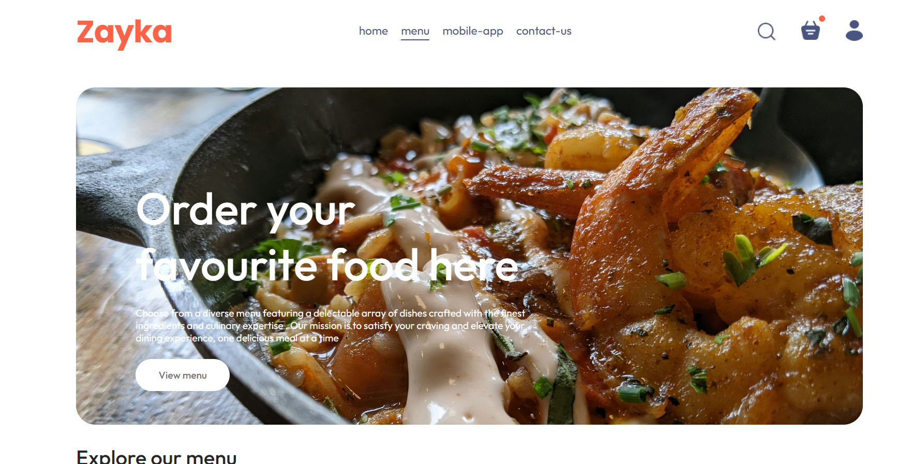
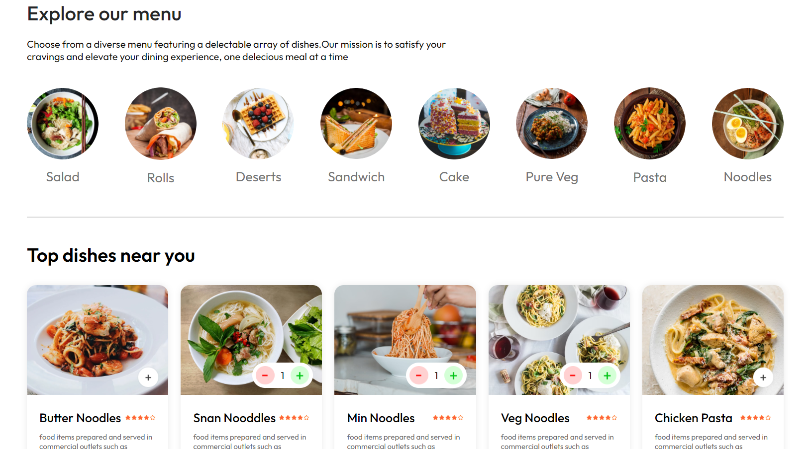
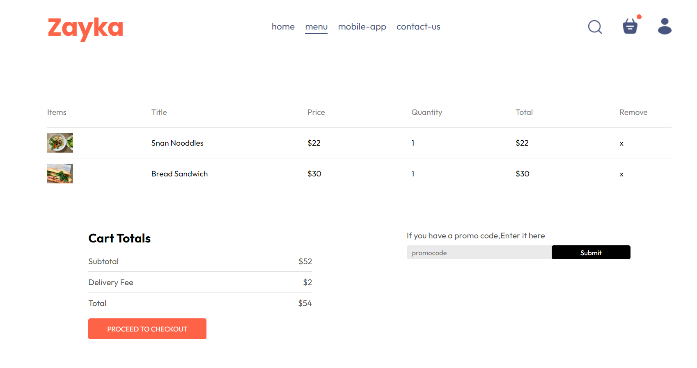
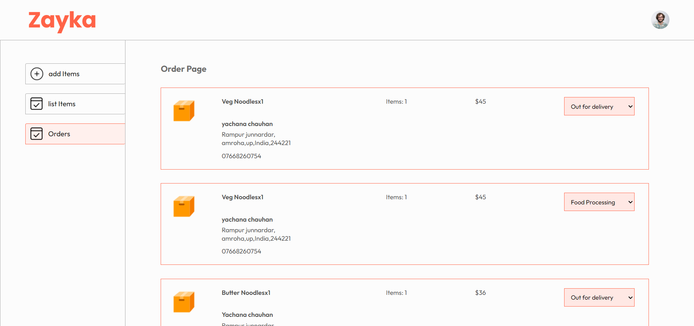

<div align="center">

# 🍕 Food-Del-App

### *Your Favorite Food, Delivered Hot & Fresh!*

[](https://www.mongodb.com/)
[](https://expressjs.com/)
[](https://reactjs.org/)
[](https://nodejs.org/)
[](https://vitejs.dev/)

### 🚀 Quick Links

[](https://new-food-delivery-app.netlify.app/)
[](https://new-food-delivery-admin.netlify.app/)

<p align="center">
  <a href="#-features">Features</a> •
  <a href="#-tech-stack">Tech Stack</a> •
  <a href="#-architecture">Architecture</a> •
  <a href="#-installation">Installation</a> •
  <a href="#-usage">Usage</a> •
  <a href="#-contributing">Contributing</a>
</p>

</div>

---

## 🎯 About

**Food-Del-App** is a full-stack food delivery application built with the MERN stack. It provides a seamless experience for customers to browse restaurants, order food, and track deliveries in real-time. The application includes a customer-facing frontend, an admin panel for restaurant management, and a robust backend API.

---

## ✨ Features

### 🛒 Customer Features
- 🔐 **User Authentication** - Secure login/signup with JWT
- 🍽️ **Browse Menu** - Explore diverse food categories
- 🛍️ **Cart Management** - Add, remove, and modify items
- 💳 **Secure Checkout** - Multiple payment options
- 📦 **Order Tracking** - Real-time order status updates
- 📜 **Order History** - View past orders and reorder

### 👨‍💼 Admin Features
- ➕ **Add New Items** - Upload food items with images
- 📋 **Manage Menu** - Update or remove existing items
- 📊 **Order Management** - View and update order statuses
- 📈 **Dashboard** - Monitor sales and analytics

### 🔧 Technical Features
- ⚡ **Fast Performance** - Built with Vite for lightning-fast builds
- 📱 **Responsive Design** - Works seamlessly on all devices
- 🔒 **Secure** - JWT authentication and protected routes
- 🎨 **Modern UI** - Clean and intuitive user interface
- 🌐 **RESTful API** - Well-structured backend architecture

---

## 🛠️ Tech Stack

### Frontend
| Technology | Purpose |
|-----------|---------|
|  | UI Library |
|  | Build Tool |
|  | Styling |
|  | Navigation |

### Backend
| Technology | Purpose |
|-----------|---------|
|  | Runtime Environment |
|  | Web Framework |
|  | Database |
|  | ODM |
|  | Authentication |

---

## 📁 Project Structure

```
Food-Del-App/
│
├── 📂 frontend-part/          # Customer-facing application
│   ├── src/
│   │   ├── components/        # Reusable UI components
│   │   ├── pages/            # Page components
│   │   ├── context/          # React Context (State Management)
│   │   ├── assets/           # Images and static files
│   │   └── App.jsx           # Main app component
│   └── package.json
│
├── 📂 admin/                  # Admin panel
│   ├── src/
│   │   ├── components/       # Navbar, Sidebar
│   │   ├── pages/           # Add, List, Orders
│   │   └── App.jsx
│   └── package.json
│
└── 📂 backend-part/           # Backend API
    ├── controllers/          # Business logic
    ├── models/              # Database schemas
    ├── routes/              # API routes
    ├── middleware/          # Auth middleware
    ├── config/              # Database config
    ├── uploads/             # Uploaded images
    └── server.js            # Entry point
```

---

## 🚀 Installation

### Prerequisites

Before you begin, ensure you have the following installed:
-  
- 
-  or 

### 📥 Clone the Repository

```bash
git clone https://github.com/Saurabhtbj1201/Food-Del-App.git
cd Food-Del-App
```

### 🔧 Backend Setup

```bash
# Navigate to backend directory
cd backend-part

# Install dependencies
npm install

# Create .env file and add your configuration
# PORT=4000
# MONGODB_URI=your_mongodb_connection_string
# JWT_SECRET=your_jwt_secret

# Start the server
npm start
```

### 🎨 Frontend Setup

```bash
# Navigate to frontend directory
cd frontend-part

# Install dependencies
npm install

# Start development server
npm run dev
```

### 👨‍💼 Admin Panel Setup

```bash
# Navigate to admin directory
cd admin

# Install dependencies
npm install

# Start development server
npm run dev
```

---

## 📸 Screenshots

<div align="center">

### 🏠 Home Page
*Beautiful landing page with featured dishes*



### 🍽️ Menu
*Browse through categorized food items*



### 🛒 Cart
*Easy cart management with checkout*



### 👨‍💼 Admin Dashboard
*Manage orders and menu items efficiently*



</div>

---

## 🤝 Contributing

Contributions are what make the open-source community such an amazing place to learn, inspire, and create. Any contributions you make are **greatly appreciated**! 🙏

### How to Contribute

1. **Fork the Project**
   ```bash
   # Click the 'Fork' button at the top right of this page
   ```

2. **Clone Your Fork**
   ```bash
   git clone https://github.com/yachana-chauhan/Food-Del-App.git
   cd Food-Del-App
   ```

3. **Create a Feature Branch**
   ```bash
   git checkout -b feature/Feature
   ```

4. **Make Your Changes**
   - Write clean, readable code
   - Follow the existing code style
   - Add comments where necessary

5. **Commit Your Changes**
   ```bash
   git add .
   git commit -m "Add some Feature"
   ```

6. **Push to Your Branch**
   ```bash
   git push origin feature/Feature
   ```

7. **Open a Pull Request**
   - Go to the original repository
   - Click on "Pull Requests" and then "New Pull Request"
   - Select your fork and branch
   - Describe your changes in detail

### 📝 Contribution Guidelines

- 🐛 **Bug Reports**: Use the issue tracker to report bugs
- ✨ **Feature Requests**: Feel free to suggest new features
- 📖 **Documentation**: Help improve our docs
- 🧪 **Testing**: Add tests for new features
- 💻 **Code Quality**: Ensure your code is clean and well-commented

---

## 📄 License

Distributed under the MIT License. See `LICENSE` for more information.

---

## 👨‍💻 Developer

<div align="center">

### Created by

<a href="https://github.com/yachana-chauhan">
  
</a>

### **Yachana Chauhan**

[](https://github.com/yachana-chauhan)

<a href="https://github.com/yachana-chauhan">
  
</a>

---

<div align="center">

### Made with ❤️ by Contributors

<a href="https://github.com/Saurabhtbj1201">
  
</a>

### **Saurabh Kumar**

[](https://github.com/Saurabhtbj1201)
[](https://linkedin.com/in/saurabhtbj1201)
[](https://twitter.com/saurabhtbj1201)
[](https://instagram.com/saurabhtbj1201)
[](https://gu-saurabh.site)

<a href="https://github.com/Saurabhtbj1201">
  
</a>

</div>


</div>

---

## 🌟 Show Your Support

Give a ⭐️ if this project helped you!

<div align="center">

### 🙏 Thank you for visiting!


</div>

---

<div align="center">

**[⬆ Back to Top](#-food-del-app)**

</div>
